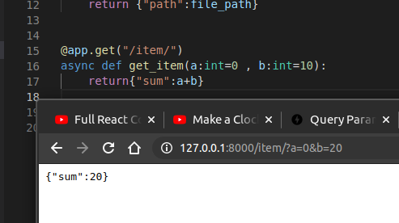

## Part-2

### Path parameters containing paths

Using an option directly from Starlette you can declare a path parameter containing a path using a URL like:

    /files/{file_path:path}

    use @app.get("files/{file_path:path}")

    You could need the parameter to contain /home/johndoe/myfile.txt, with a leading slash (/).

    In that case, the URL would be: /files//home/johndoe/myfile.txt, with a double slash (//) between files and home.

## Defaults  Param
As query parameters are not a fixed part of a path, they can be optional and can have default values.
Eg

## Optional parameters

The same way, you can declare optional query parameters, by setting their default to **None**

- TODO

## Query parameter type conversion

## Multiple path and query parameters

## Required query parameters
