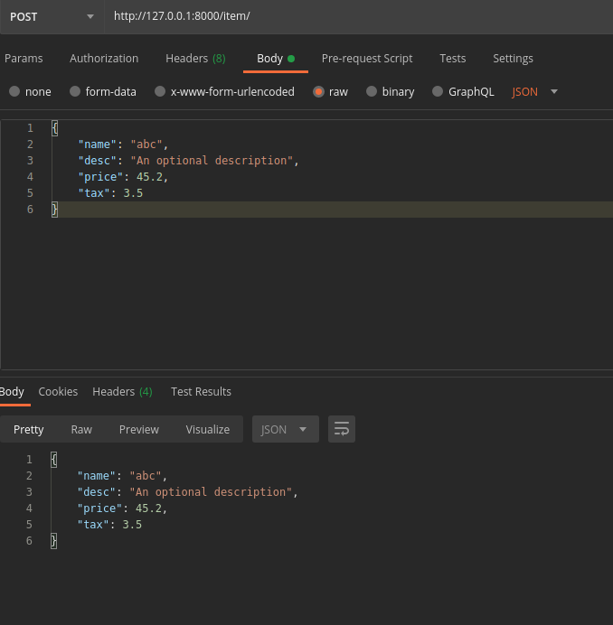

## Part-3

### Request Body

    Your API almost always has to send a response body.
    But clients don't necessarily need to send request bodies all the time.

API call doc pic

    class Item(BaseModel):
        name  : str
        desc  : Optional[str] = None
        price : float
        tax   : Optional[float] = None

    app= FastAPI()

    @app.post("/item/")
    async def create_Item(item:Item):
        return item

