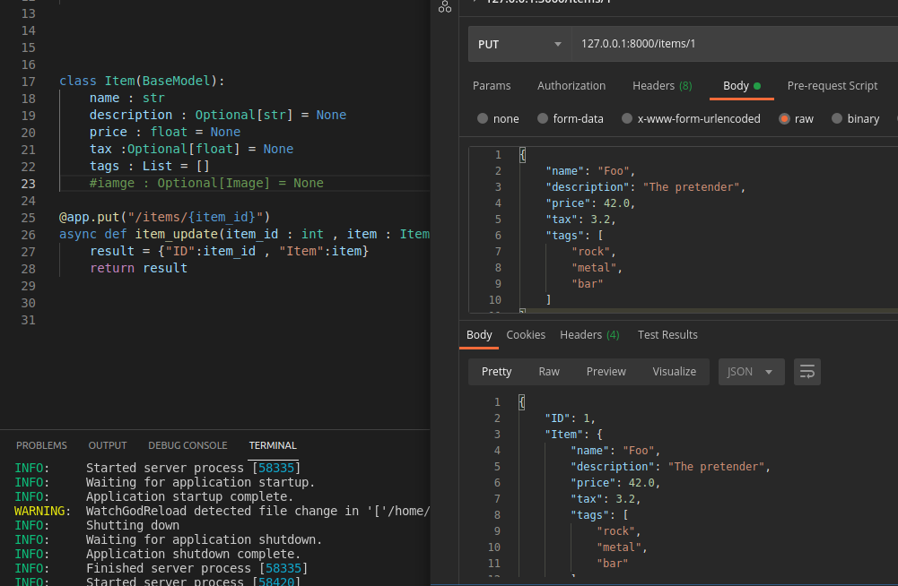

## Part-6 || Body - Nested Models

## List Fields

### List fields with type parameter
    First, import List from standard Python's typing module:
    from typing import List, Optional
    
    We can use
        tags: List[] = []
    and also 
        tags: List[str] = []

### Set
    tags: Set[str] = set()

## Nested Models
    Define submodel
    Use submodel as a type

### Special types and validation
    https://pydantic-docs.helpmanual.io/usage/types/

### Bodies of pure lists
