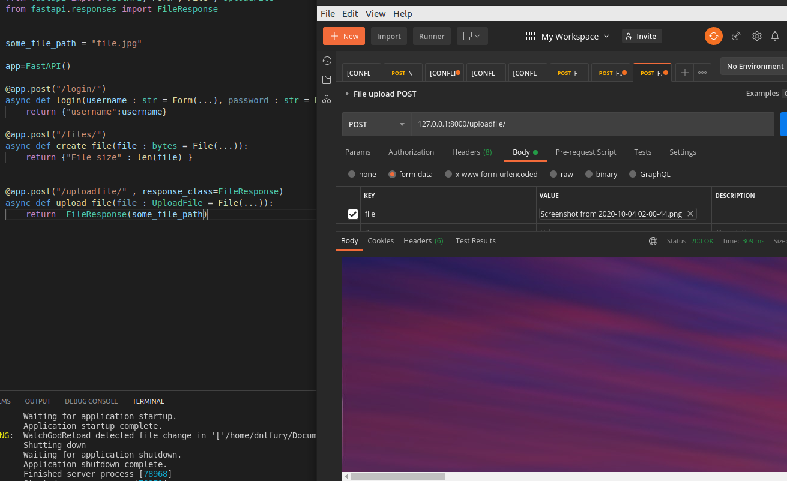

## Form Data Part-8

When you need to receive form fields instead of JSON, you can use Form.

To use forms, first install python-multipart.

    $ pip install python-multipart

## Request Files

To receive uploaded files, first install python-multipart.

    pip install python-multipart

This is because uploaded files are sent as "form data".

    Import File and UploadFile from fastapi

